# IP Shield (Ethereum)

IP Shield is a simple Ethereum dApp for registering a file hash on-chain and later verifying that the same file existed at a specific time.


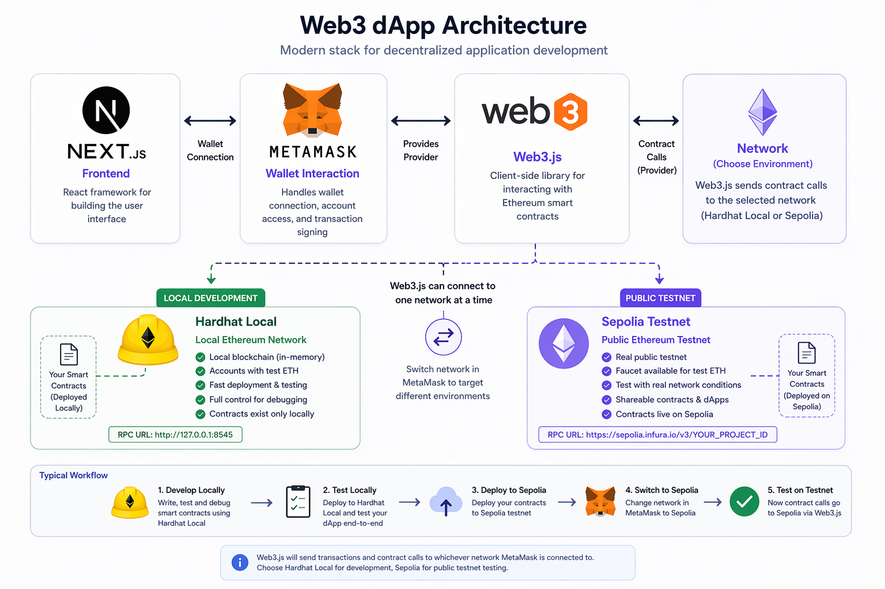

## Table Of Contents

- [Learning Goal](#learning-goal)
- [Project Overview](#project-overview)
- [Technology Used](#technology-used)
- [Requirements](#requirements)
- [Chapter 1: Create The Project Folder](#chapter-1-create-the-project-folder)
- [Chapter 2: Set Up Hardhat Backend](#chapter-2-set-up-hardhat-backend)
- [Chapter 3: Write The Smart Contract](#chapter-3-write-the-smart-contract)
- [Chapter 4: Write The Deployment Script](#chapter-4-write-the-deployment-script)
- [Chapter 5: Create The Next.js Frontend](#chapter-5-create-the-nextjs-frontend)
- [Chapter 6: Add The Frontend Template](#chapter-6-add-the-frontend-template)
- [Chapter 7: Run Hardhat Local](#chapter-7-run-hardhat-local)
- [Chapter 8: Configure MetaMask For Hardhat Local](#chapter-8-configure-metamask-for-hardhat-local)
- [Chapter 9: Test The Local Web App](#chapter-9-test-the-local-web-app)
- [Chapter 10: Deploy To Sepolia Testnet](#chapter-10-deploy-to-sepolia-testnet)
- [How The App Works](#how-the-app-works)
- [Useful Commands](#useful-commands)
- [Common Issues](#common-issues)
- [Final Checklist](#final-checklist)
- [Future Direction](#future-direction)

## Learning Goal

By the end of this guide, students should understand how a simple Ethereum dApp is built from scratch.

Students should experience:

- Creating a Node.js project
- Installing Hardhat
- Writing a Solidity smart contract
- Compiling and deploying the contract
- Running a local blockchain
- Connecting MetaMask to Hardhat Local
- Creating a Next.js frontend
- Connecting the frontend to the deployed smart contract
- Testing upload and verification locally
- Deploying the same contract to Sepolia testnet


## Project Overview

This project protects a file by storing its SHA-256 hash on the Ethereum blockchain.

1. Reads the file in the browser.
2. Generates a unique hash for the file.
3. Stores that hash and file metadata in a smart contract.
4. Lets the user verify later whether the same file already exists on-chain.

In simple terms:

```text
File -> SHA-256 hash -> Smart contract -> Blockchain timestamp
```

This creates proof that the file existed at a certain time and was registered by a wallet address.

## Technology Used

This project uses:

- Hardhat for smart contract compilation, local blockchain testing, and deployment
- Solidity for the smart contract
- Next.js for the frontend web app
- Web3.js for browser-to-contract interaction
- MetaMask for wallet connection and transaction approval
- Alchemy or another RPC provider for Sepolia testnet access
- Sepolia for public Ethereum testnet deployment
- Hardhat Local for local development on your own computer

Hardhat is installed inside the project. Students do not need to install Hardhat globally.

## Requirements

Install or prepare these before starting:

- Node.js LTS and npm
- Visual Studio Code or another code editor
- MetaMask browser extension
- A Sepolia RPC endpoint from Alchemy or another provider
- Sepolia ETH if you want to deploy or test on Sepolia

Check Node.js and npm:

```bash
node -v
npm -v
```

If both commands print version numbers, Node.js and npm are installed.

## Chapter 1: Create The Project Folder

Open a terminal and create a new empty project folder:

```bash
mkdir IP-Protection
cd IP-Protection
```

Open the folder in VS Code:

```bash
code .
```

If `code .` does not work, open VS Code manually and choose:

```text
File -> Open Folder -> IP-Protection
```

Open the VS Code terminal:

```text
Ctrl + `
```

Your terminal should now be inside the `IP-Protection` folder.

## Chapter 2: Set Up Hardhat Backend

### 1. Create A Node.js Project

At the project root, run:

```bash
npm init -y
```

This creates:

```text
package.json
```

### 2. Install Hardhat And Backend Dependencies

Run:

```bash
npm install --save-dev hardhat @nomicfoundation/hardhat-ethers dotenv
```

These packages are used for:

- `hardhat`: compile, test, and deploy smart contracts
- `@nomicfoundation/hardhat-ethers`: connect Hardhat with ethers.js
- `dotenv`: read private values from `.env`

Set the project to use ES Modules:

```bash
npm pkg set type="module"
```

This lets Hardhat use `import` and `export` syntax in `hardhat.config.js`.

### 3. Create Backend Folders

Run:

```bash
mkdir contracts
mkdir scripts
```

Your project should now look like:

```text
IP-Protection/
|-- contracts/
|-- scripts/
|-- package.json
```

### 4. Add Project Scripts

Open `package.json`.

Replace the `scripts` section with:

```json
"scripts": {
  "compile": "hardhat compile",
  "node": "hardhat node",
  "deploy:local": "hardhat run scripts/deploy.js --network localhost",
  "deploy:sepolia": "hardhat run scripts/deploy.js --network sepolia"
}
```

The full `package.json` will also contain dependencies. That is normal.

### 5. Create Hardhat Configuration

Create a file at the project root:

```text
hardhat.config.js
```

Paste:

```js
import "dotenv/config";
import "@nomicfoundation/hardhat-ethers";

const { PRIVATE_KEY, SEPOLIA_RPC_URL, ALCHEMY_API_KEY } = process.env;

const sepoliaRpcUrl = SEPOLIA_RPC_URL || (
  ALCHEMY_API_KEY ? `https://eth-sepolia.g.alchemy.com/v2/${ALCHEMY_API_KEY}` : undefined
);

const normalizedPrivateKey = PRIVATE_KEY
  ? (PRIVATE_KEY.startsWith("0x") ? PRIVATE_KEY : `0x${PRIVATE_KEY}`)
  : undefined;

const networks = {
  localhost: {
    url: "http://127.0.0.1:8545",
  },
};

if (sepoliaRpcUrl && normalizedPrivateKey) {
  networks.sepolia = {
    url: sepoliaRpcUrl,
    accounts: [normalizedPrivateKey],
  };
}

export default {
  solidity: "0.8.19",
  networks,
};
```

This config supports:

- Hardhat Local at `http://127.0.0.1:8545`
- Sepolia if `.env` contains a private key and RPC URL

## Chapter 3: Write The Smart Contract

Create this file:

```text
contracts/HashStorage.sol
```

Paste:

```solidity
// SPDX-License-Identifier: MIT
pragma solidity ^0.8.0;

contract HashStorage {
    struct HashData {
        bytes32 hash;
        string fileName;
        string fileType;
        string fileSize;
        uint256 timestamp;
        bool exists;
    }

    mapping(bytes32 => HashData) public hashRecords;
    bytes32[] public allHashes;

    event HashStored(
        bytes32 indexed hash,
        string fileName,
        string fileType,
        string fileSize,
        uint256 timestamp
    );

    function storeHash(
        bytes32 _hash,
        string memory _fileName,
        string memory _fileType,
        string memory _fileSize
    ) public {
        require(!hashRecords[_hash].exists, "Hash already exists");

        hashRecords[_hash] = HashData({
            hash: _hash,
            fileName: _fileName,
            fileType: _fileType,
            fileSize: _fileSize,
            timestamp: block.timestamp,
            exists: true
        });

        allHashes.push(_hash);
        emit HashStored(_hash, _fileName, _fileType, _fileSize, block.timestamp);
    }

    function getHashData(bytes32 _hash) public view returns (
        bytes32,
        string memory,
        string memory,
        string memory,
        uint256
    ) {
        require(hashRecords[_hash].exists, "Hash does not exist");

        HashData memory data = hashRecords[_hash];
        return (
            data.hash,
            data.fileName,
            data.fileType,
            data.fileSize,
            data.timestamp
        );
    }

    function getAllHashes() public view returns (bytes32[] memory) {
        return allHashes;
    }

    function hashExists(bytes32 _hash) public view returns (bool) {
        return hashRecords[_hash].exists;
    }
}
```

Compile the contract:

```bash
npm run compile
```

Expected result:

```text
Compiled 1 Solidity file successfully
```

If it says `Nothing to compile`, that is also fine.

## Chapter 4: Write The Deployment Script

Create this file:

```text
scripts/deploy.js
```

Paste:

```js
import fs from "node:fs";
import path from "node:path";
import { fileURLToPath } from "node:url";
import hre from "hardhat";

const __filename = fileURLToPath(import.meta.url);
const __dirname = path.dirname(__filename);

function getExplorerTxBaseUrl(chainId) {
  if (chainId === "11155111") {
    return "https://sepolia.etherscan.io/tx/";
  }

  return "";
}

function getNetworkName(chainId, networkName) {
  if (chainId === "31337") {
    return "Hardhat Local";
  }

  if (chainId === "11155111") {
    return "Sepolia Testnet";
  }

  return networkName;
}

async function main() {
  const HashStorage = await hre.ethers.getContractFactory("HashStorage");
  const hashStorage = await HashStorage.deploy();
  await hashStorage.waitForDeployment();

  const address = await hashStorage.getAddress();
  const network = await hre.ethers.provider.getNetwork();
  const chainId = network.chainId.toString();

  const artifact = await hre.artifacts.readArtifact("HashStorage");
  const deployment = {
    address,
    abi: artifact.abi,
    explorerTxBaseUrl: getExplorerTxBaseUrl(chainId),
    network: chainId,
    networkName: getNetworkName(chainId, hre.network.name),
  };

  const deploymentDir = path.join(__dirname, "..", "client", "lib", "deployments");
  fs.mkdirSync(deploymentDir, { recursive: true });
  fs.writeFileSync(
    path.join(deploymentDir, `${chainId}.json`),
    JSON.stringify(deployment, null, 2),
  );

  console.log(`HashStorage deployed to ${address} on chain ${chainId}`);
}

main().catch((error) => {
  console.error(error);
  process.exitCode = 1;
});
```

This script deploys the contract and creates a deployment file for the frontend.

For example:

```text
client/lib/deployments/31337.json
client/lib/deployments/11155111.json
```

The frontend uses these files to know which contract address and ABI to use.

## Chapter 5: Create The Next.js Frontend

Now create the frontend app.

At the project root, run:

```bash
npx create-next-app@latest client
```

When prompted, choose:

```text
Would you like to use the recommended Next.js defaults?
Yes, use recommended defaults
```

Move into the frontend folder:

```bash
cd client
```

Run the default Next.js frontend:

```bash
npm run dev
```

Open:

```text
http://localhost:3000
```

Expected result:


Stop the frontend server before continuing:

```text
Ctrl + C
```

Install the frontend blockchain and UI dependencies:

```bash
npm install web3 lucide-react sonner
```

Initialize shadcn/ui:

```bash
npx shadcn@latest init
```

When prompted, choose:

```text
Component library: Radix
Preset: Nova
```

Add the UI components used by the app:

```bash
npx shadcn@latest add badge card dialog input label table
```

Return to the project root:

```bash
cd ..
```

## Chapter 6: Add The Frontend Template

### 1. Download The Template Zip

Download the provided zip file:

```text
frontend-template.zip
```

Place `frontend-template.zip` in the project root, beside the `client` folder.

The project should look like this:

```text
IP-Protection/
|-- client/
|-- contracts/
|-- scripts/
|-- frontend-template.zip
|-- hardhat.config.js
|-- package.json
```

### 2. Extract The Template Into The Frontend

Run this from the project root:

```powershell
Expand-Archive -Force .\frontend-template.zip .\client\
```

This extracts the template files into the existing `client` folder.

If students are using macOS or Linux, they can run:

```bash
unzip -o frontend-template.zip -d client/
```

After extracting, the student's `client` folder should contain:

```text
client/app/page.tsx
client/app/layout.tsx
client/app/globals.css
client/app/dashboard/page.tsx
client/app/dashboard/verify/page.tsx
client/components/asset-list.tsx
client/components/file-uploader.tsx
client/lib/contract-config.ts
client/lib/ethereum.ts
client/lib/hash.ts
client/lib/utils.ts
client/lib/web3.ts
client/lib/deployments/31337.json
client/lib/deployments/5777.json
client/lib/deployments/11155111.json
```

### 3. Review The Important Frontend Files

- `client/lib/hash.ts`: generates the SHA-256 file hash
- `client/lib/ethereum.ts`: gets the MetaMask provider and checks supported networks
- `client/lib/contract-config.ts`: chooses the correct deployment file based on MetaMask chain ID
- `client/lib/web3.ts`: calls the smart contract from the frontend
- `client/app/dashboard/page.tsx`: upload and register files
- `client/app/dashboard/verify/page.tsx`: verify whether a file already exists on-chain

### 4. Understand The Deployment Files

The template zip includes placeholder deployment files:

```text
client/lib/deployments/31337.json
client/lib/deployments/5777.json
client/lib/deployments/11155111.json
```

Do not manually edit the placeholder values.

The real deployment values are generated when running:

```bash
npm run deploy:local
npm run deploy:sepolia
```

Those commands overwrite the matching files in:

```text
client/lib/deployments/
```

## Chapter 7: Run Hardhat Local

Hardhat Local is a temporary Ethereum blockchain running on your computer.

Important rule:

```text
If the Hardhat node restarts, the local blockchain resets.
After every restart, run npm run deploy:local again.
```

Use three terminals for local development.

### Terminal 1: Start The Local Blockchain

At the project root, run:

```bash
npm run node
```

Keep this terminal running.

Expected result:

```text
Started HTTP and WebSocket JSON-RPC server at http://127.0.0.1:8545/
```

Hardhat will print test accounts and private keys.

These accounts are for local testing only. Never send real funds to these accounts.

### Terminal 2: Deploy Locally

Open a second terminal at the project root.

Run:

```bash
npm run deploy:local
```

Expected result:

```text
HashStorage deployed to 0x5FbDB2315678afecb367f032d93F642f64180aa3 on chain 31337
```

This creates or updates:

```text
client/lib/deployments/31337.json
```

Do this after creating the `client` folder so the deployment file is written into the frontend project.

### Terminal 3: Start The Frontend

Open a third terminal.

Move into the frontend folder:

```bash
cd client
```

Run:

```bash
npm run dev
```

Keep this terminal running. The app will be opened after MetaMask is configured in the next chapter.

## Chapter 8: Configure MetaMask For Hardhat Local

### 1. Add The Hardhat Local Network

Open MetaMask, click the menu icon, choose `Networks`, then click `Add a custom network`.

<table>
  <tr>
    <td align="center"><strong>1. Open Menu</strong></td>
    <td align="center"><strong>2. Networks</strong></td>
    <td align="center"><strong>3. Add Custom Network</strong></td>
    <td align="center"><strong>4. Network Form</strong></td>
  </tr>
  <tr>
    <td>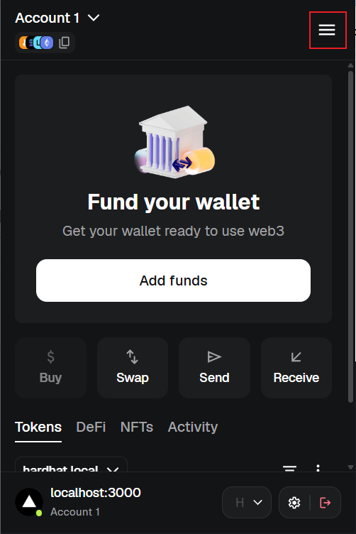</td>
    <td>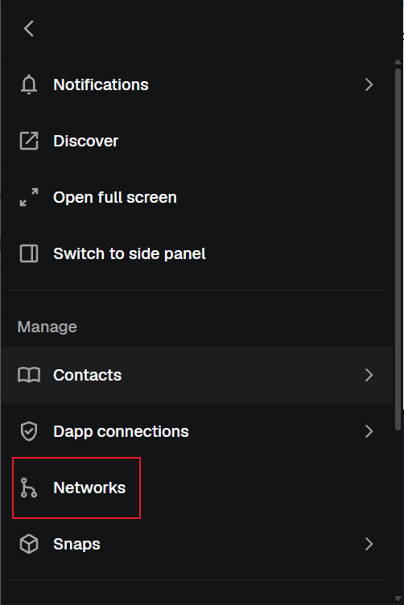</td>
    <td>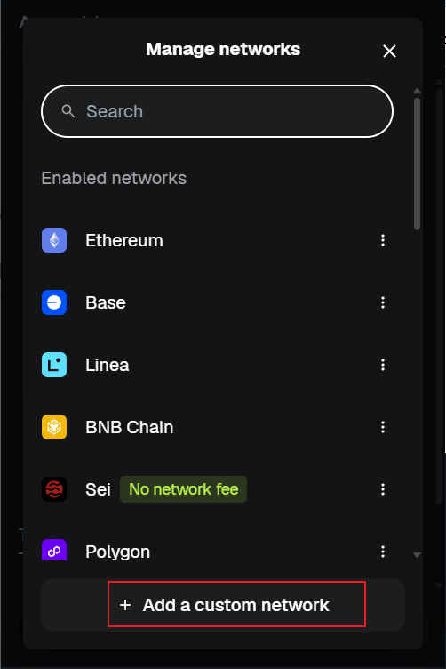</td>
    <td>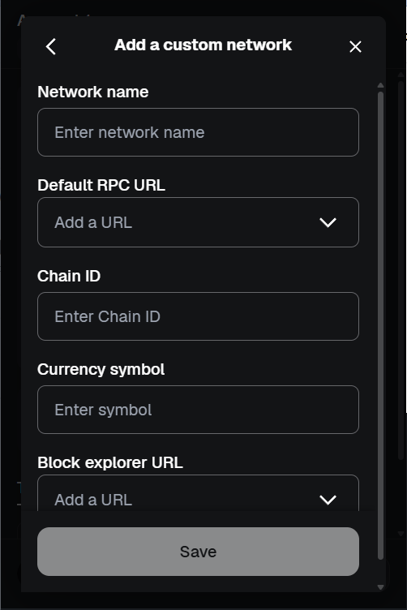</td>
  </tr>
</table>

Use these network values:

```text
Network name: Hardhat Local
RPC URL: http://127.0.0.1:8545
Chain ID: 31337
Currency symbol: ETH
```

Save the network.

### 2. Import A Hardhat Test Account

In Terminal 1, Hardhat prints several accounts.

Choose one private key from the list.

In MetaMask:

1. Open the account menu.
2. Select `Import account`.
3. Paste the Hardhat private key.
4. Import the account.

<table>
  <tr>
    <td align="center"><strong>1. Account Menu</strong></td>
    <td align="center"><strong>2. Import Account</strong></td>
    <td align="center"><strong>3. Paste Private Key</strong></td>
  </tr>
  <tr>
    <td>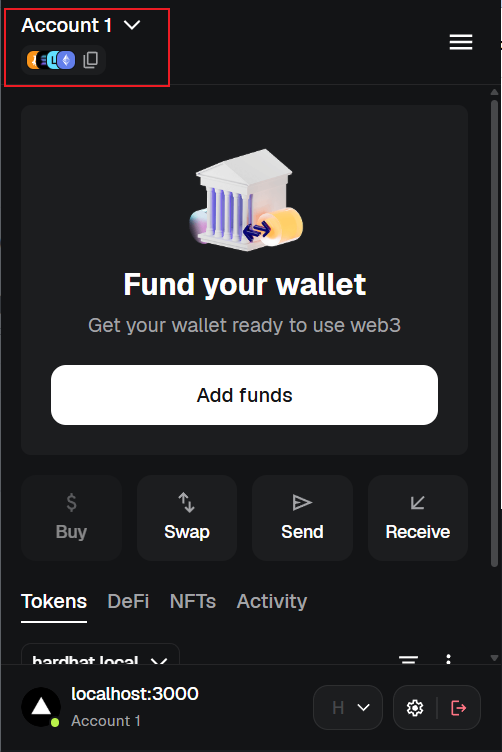</td>
    <td>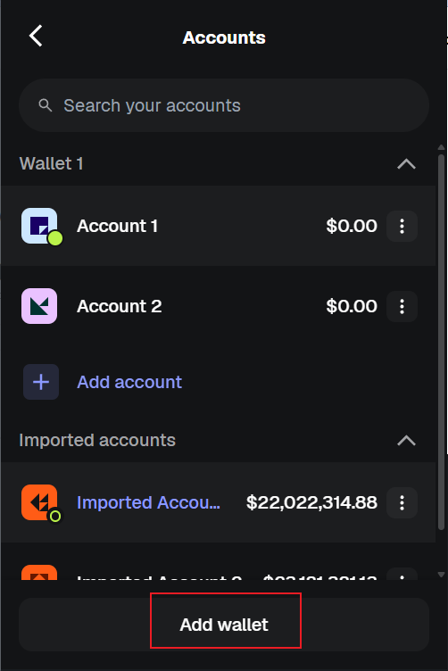</td>
    <td>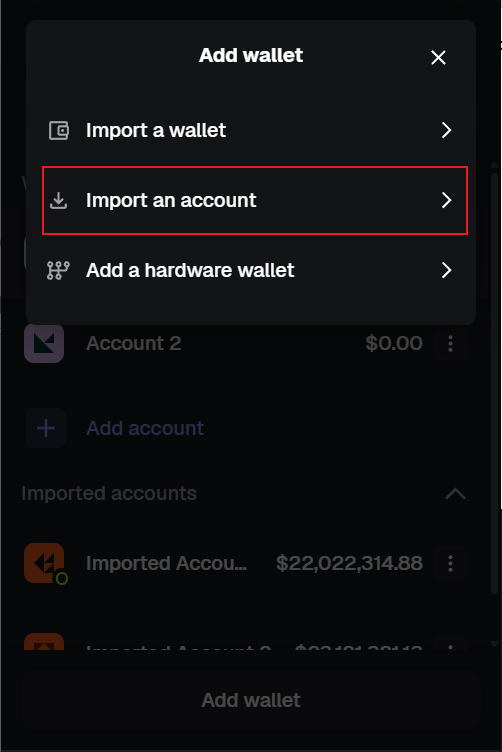</td>
  </tr>
</table>

The account should show test ETH on Hardhat Local.

These private keys are public and unsafe. Use them only on Hardhat Local.

### 3. Connect MetaMask To The App

In the browser, open:

```text
http://localhost:3000/dashboard
```

Connect MetaMask to the site.

Expected result in the app header:

```text
Hardhat Local | Contract: 0x5Fbd...0aa3
```


## Chapter 9: Test The Local Web App

Make sure:

- Terminal 1 is running `npm run node`
- Terminal 2 already ran `npm run deploy:local`
- Terminal 3 is running `npm run dev` inside `client`
- MetaMask is on Hardhat Local
- MetaMask is using an imported Hardhat test account

### 1. Upload A File

On the dashboard:

1. Click `Select Files`.
2. Choose any file from your computer.
3. Approve the MetaMask transaction.
4. Wait for the transaction to finish.

Expected result:

- The file appears in `Your Protected Assets`.
- The total asset count increases.
- The transaction is stored on Hardhat Local.

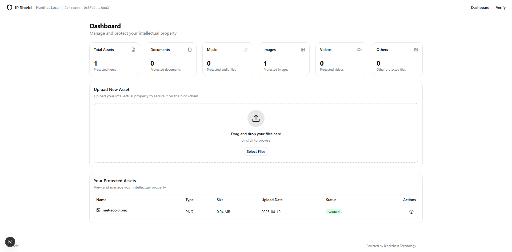

### 2. Verify The Same File

Open:

```text
http://localhost:3000/dashboard/verify
```

Upload the same file again.

Expected result:

```text
Verification Successful
```

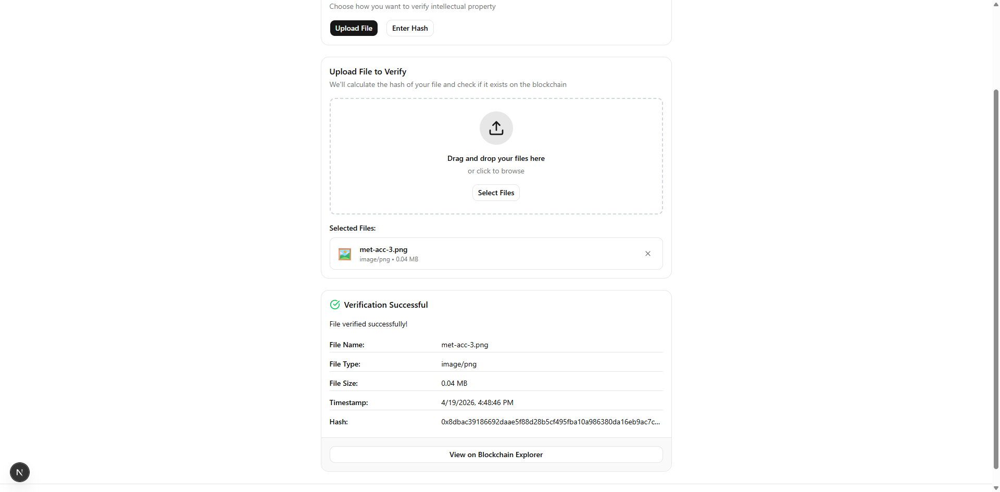

This means the generated file hash matches a hash already stored in the smart contract.

### 3. Verify A Different File

Upload a different file on the verify page.

Expected result:

```text
Verification Failed
```

This means the file hash was not found in the smart contract.

## Chapter 10: Deploy To Sepolia Testnet

Sepolia is a public Ethereum testnet. Use Sepolia when you want to test the app on a real public test network.

Unlike Hardhat Local, Sepolia needs:

- A wallet with Sepolia ETH
- An RPC URL from Alchemy or another provider
- A private key for deployment

### 1. Create An Alchemy Sepolia RPC URL

Alchemy gives the project access to a Sepolia Ethereum node.

In simple terms:

```text
Your project -> Alchemy RPC URL -> Sepolia blockchain
```

Steps:

1. Create or log in to an Alchemy account.
2. Create an Ethereum app.
3. Choose Sepolia as the network.
4. Open the app's network or API key details.
5. Copy the HTTPS RPC URL.

<table>
  <tr>
    <td align="center"><strong>1</strong></td>
    <td align="center"><strong>2</strong></td>
    <td align="center"><strong>3</strong></td>
  </tr>
  <tr>
    <td>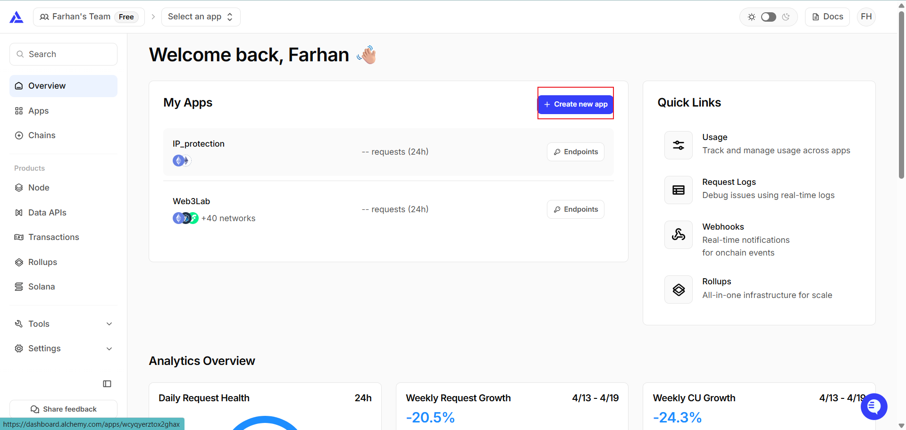</td>
    <td>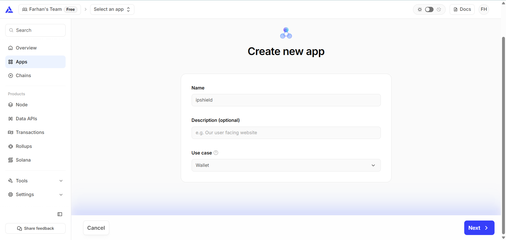</td>
    <td>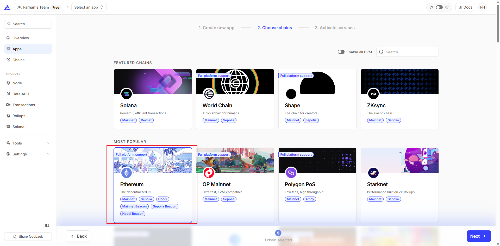</td>
  </tr>
</table>

<table>
  <tr>
    <td align="center"><strong>4</strong></td>
    <td align="center"><strong>5</strong></td>
  </tr>
  <tr>
    <td>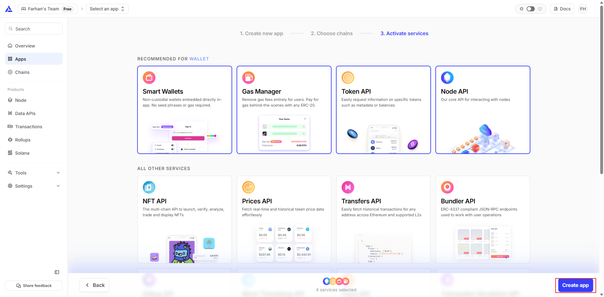</td>
    <td>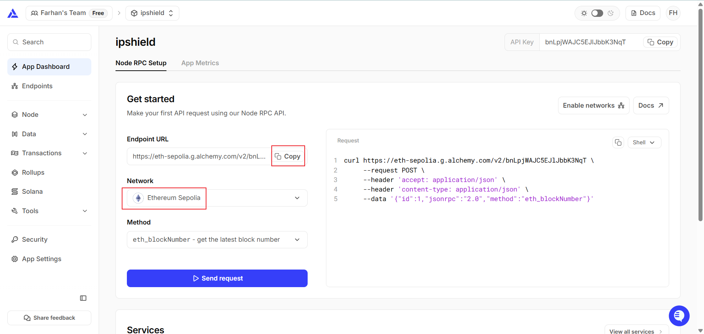</td>
  </tr>
</table>

The URL usually looks like:

```text
https://eth-sepolia.g.alchemy.com/v2/your_api_key
```

### 2. Create The Environment File

At the project root, create:

```text
.env
```

Add:

```env
PRIVATE_KEY=your_wallet_private_key
SEPOLIA_RPC_URL=https://eth-sepolia.g.alchemy.com/v2/your_api_key
```

To find the private key in MetaMask, open the account details and choose `Show private key`.

<table>
  <tr>
    <td align="center"><strong>1. Account Details</strong></td>
    <td align="center"><strong>2. Show Private Key</strong></td>
    <td align="center"><strong>3. Copy Private Key</strong></td>
  </tr>
  <tr>
    <td>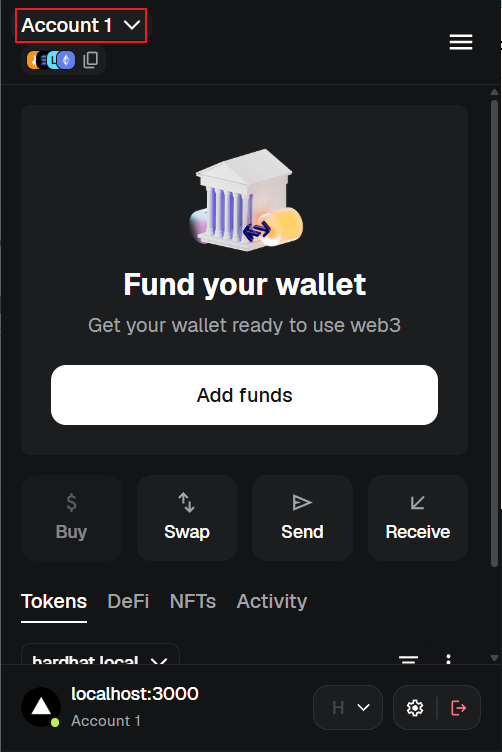</td>
    <td>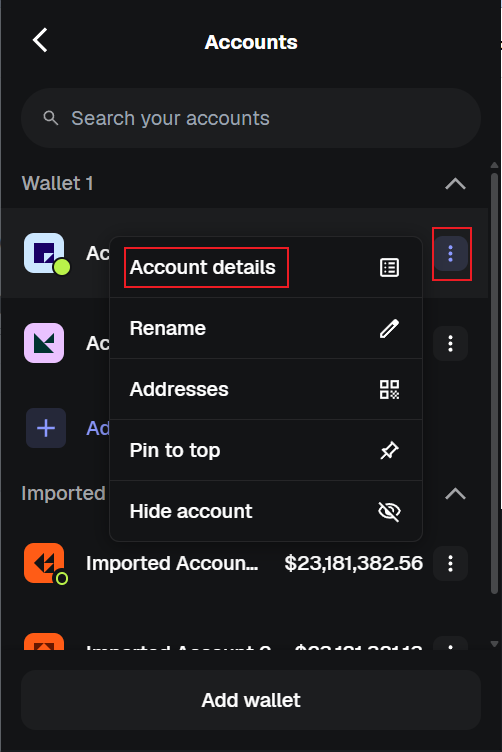</td>
    <td>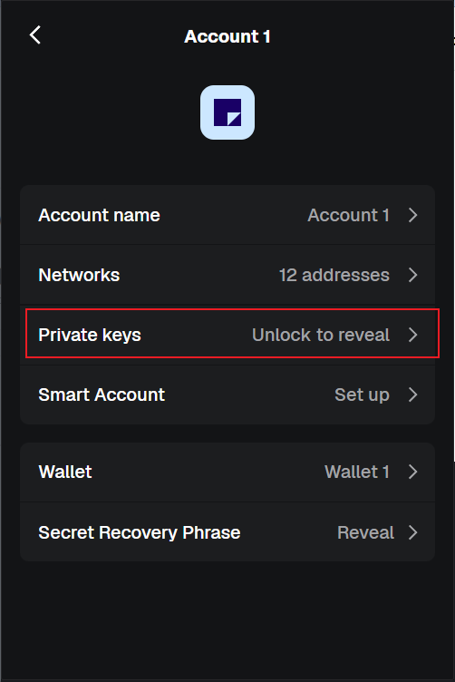</td>
  </tr>
</table>

Security notes:

- Use a test wallet, not your main wallet.
- Use the private key for one account only.
- Do not commit `.env` to GitHub.

### 3. Fund The Wallet With Sepolia ETH

The wallet behind `PRIVATE_KEY` needs Sepolia ETH to pay deployment gas.

Example faucet:

```text
https://cloud.google.com/application/web3/faucet/ethereum/sepolia
```

Copy your wallet address from MetaMask and request Sepolia ETH from the faucet.

### 4. Deploy The Smart Contract To Sepolia

At the project root, run:

```bash
npm run deploy:sepolia
```

Expected result:

```text
HashStorage deployed to 0x... on chain 11155111
```

This creates or updates:

```text
client/lib/deployments/11155111.json
```

### 5. Test The Sepolia Frontend

In the frontend terminal, keep running:

```bash
npm run dev
```

Open:

```text
http://localhost:3000/dashboard
```

Switch MetaMask to Sepolia.

Expected result in the app header:

```text
Sepolia Testnet | Contract: 0x...
```

Test the flow:

1. Upload a file on the dashboard.
2. Approve the transaction in MetaMask.
3. Wait for confirmation.
4. Verify the same file on the verify page.
5. Open the transaction in Etherscan if the app provides a link.

Sepolia transactions are public and can be viewed on:

```text
https://sepolia.etherscan.io/
```

## How The App Works

### Smart Contract

The smart contract is:

```text
contracts/HashStorage.sol
```

It stores:

- File hash
- File name
- File type
- File size
- Blockchain timestamp

Main functions:

- `storeHash`: stores a new file hash
- `getAllHashes`: returns all stored hashes
- `getHashData`: returns metadata for a stored hash
- `hashExists`: checks whether a hash already exists

### File Hashing

The frontend hashes the file in:

```text
client/lib/hash.ts
```

The app uses SHA-256.

If the file content changes, the hash changes.

That means:

```text
same file -> same hash
different file -> different hash
```

### Contract Resolution

The frontend checks the current MetaMask chain ID and loads the matching deployment file.

Deployment files:

```text
client/lib/deployments/31337.json
client/lib/deployments/11155111.json
```

Network IDs:

```text
31337    Hardhat Local
11155111 Sepolia Testnet
```

So when MetaMask is on Hardhat Local, the app uses `31337.json`.

When MetaMask is on Sepolia, the app uses `11155111.json`.

## Useful Commands

Run these from the project root:

```bash
npm init -y
npm install --save-dev hardhat @nomicfoundation/hardhat-ethers dotenv
npm pkg set type="module"
npm run compile
npm run node
npm run deploy:local
npm run deploy:sepolia
```

Run these from the `client` folder:

```bash
npm install web3 lucide-react sonner
npx shadcn@latest init
npx shadcn@latest add badge card dialog input label table
npm run dev
npm run build
```

Local development usually needs three terminals:

```text
Terminal 1: npm run node
Terminal 2: npm run deploy:local
Terminal 3: cd client && npm run dev
```

## Common Issues

### App Shows The Wrong Network

Make sure MetaMask is on the correct network:

```text
Hardhat Local: 31337
Sepolia: 11155111
```

Then hard refresh:

```text
Ctrl + Shift + R
```

### Parameter Decoding Error

Example error:

```text
Parameter decoding error: Returned values aren't valid
```

Common cause:

```text
The frontend is pointing to a contract address, but the current local Hardhat node does not have that contract deployed.
```

Fix:

1. Keep `npm run node` running.
2. Run `npm run deploy:local` again.
3. Refresh the browser.

This often happens after restarting the Hardhat node.

### Local Contract Disappears After Restart

Hardhat Local is temporary.

Every time `npm run node` restarts, previous local contracts and transactions disappear.

Fix:

```bash
npm run deploy:local
```

### MetaMask Does Not Switch Correctly

Try these steps:

1. Switch MetaMask to the correct network.
2. Disconnect the site in MetaMask.
3. Refresh the browser.
4. Connect the wallet again.

You can check what chain the browser sees by opening DevTools and running:

```js
await window.ethereum.request({ method: "eth_chainId" })
```

Expected values:

```text
0x7a69   Hardhat Local
0xaa36a7 Sepolia
```

### Upload Works On IP Address But Not Localhost

Use:

```text
http://localhost:3000
```

Browser file hashing uses Web Crypto. `localhost` is the safer development origin.

### Sepolia Deploy Fails With Private Key Error

Your `.env` must contain a single account private key.

Do not use:

- A wallet address
- A Secret Recovery Phrase
- A JSON wallet file

Correct format:

```env
PRIVATE_KEY=your_private_key
SEPOLIA_RPC_URL=your_sepolia_rpc_url
```

### Require Is Not Defined In ES Module Scope

Example error:

```text
ReferenceError: require is not defined in ES module scope
```

This happens when `package.json` contains `"type": "module"`, but `hardhat.config.js` or `scripts/deploy.js` still uses CommonJS syntax such as:

```js
require("dotenv").config();
module.exports = {};
```

Fix it by using ESM syntax:

```js
import "dotenv/config";

export default {};
```

Also make sure `scripts/deploy.js` uses `import` instead of `require`.

### Hardhat Says It Only Supports ESM Projects

Example error:

```text
Hardhat only supports ESM projects.
Please make sure you have "type": "module" in your package.json.
```

Fix it by running:

```bash
npm pkg set type="module"
```

Then run:

```bash
npm run compile
```

### Not Enough Sepolia ETH

If deployment or upload fails on Sepolia, check that your MetaMask account has Sepolia ETH.

Use a Sepolia faucet and try again after the funds arrive.

